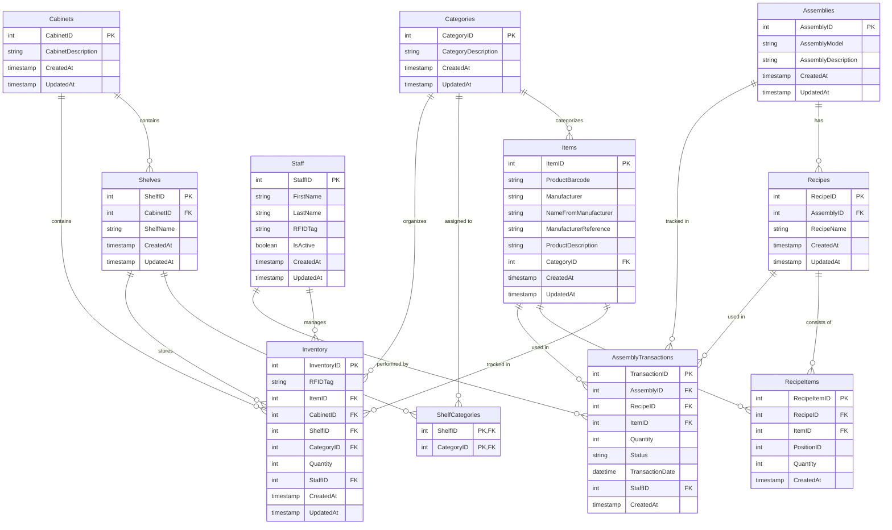

```mermaid

erDiagram
    Categories {
        int CategoryID PK
        string CategoryDescription
        timestamp CreatedAt
        timestamp UpdatedAt
    }
    
    Cabinets {
        int CabinetID PK
        string CabinetDescription
        timestamp CreatedAt
        timestamp UpdatedAt
    }
    
    Shelves {
        int ShelfID PK
        int CabinetID FK
        string ShelfName
        timestamp CreatedAt
        timestamp UpdatedAt
    }
    
    ShelfCategories {
        int ShelfID PK,FK
        int CategoryID PK,FK
    }
    
    Items {
        int ItemID PK
        string ProductBarcode
        string Manufacturer
        string NameFromManufacturer
        string ManufacturerReference
        string ProductDescription
        int CategoryID FK
        timestamp CreatedAt
        timestamp UpdatedAt
    }
    
    Staff {
        int StaffID PK
        string FirstName
        string LastName
        string RFIDTag
        boolean IsActive
        timestamp CreatedAt
        timestamp UpdatedAt
    }
    
    Inventory {
        int InventoryID PK
        string RFIDTag
        int ItemID FK
        int CabinetID FK
        int ShelfID FK
        int CategoryID FK
        int Quantity
        int StaffID FK
        timestamp CreatedAt
        timestamp UpdatedAt
    }
    
    Assemblies {
        int AssemblyID PK
        string AssemblyModel
        string AssemblyDescription
        timestamp CreatedAt
        timestamp UpdatedAt
    }
    
    Recipes {
        int RecipeID PK
        int AssemblyID FK
        string RecipeName
        timestamp CreatedAt
        timestamp UpdatedAt
    }
    
    RecipeItems {
        int RecipeItemID PK
        int RecipeID FK
        int ItemID FK
        int PositionID
        int Quantity
        timestamp CreatedAt
    }
    
    AssemblyTransactions {
        int TransactionID PK
        int AssemblyID FK
        int RecipeID FK
        int ItemID FK
        int Quantity
        string Status
        datetime TransactionDate
        int StaffID FK
        timestamp CreatedAt
    }

    Categories ||--o{ Items : "categorizes"
    Cabinets ||--o{ Shelves : "contains"
    Categories ||--o{ ShelfCategories : "assigned to"
    Shelves ||--o{ ShelfCategories : "has"
    Items ||--o{ Inventory : "tracked in"
    Shelves ||--o{ Inventory : "stores"
    Cabinets ||--o{ Inventory : "contains"
    Categories ||--o{ Inventory : "organizes"
    Staff ||--o{ Inventory : "manages"
    Assemblies ||--o{ Recipes : "has"
    Recipes ||--o{ RecipeItems : "consists of"
    Items ||--o{ RecipeItems : "used in"
    Assemblies ||--o{ AssemblyTransactions : "tracked in"
    Recipes ||--o{ AssemblyTransactions : "used in"
    Items ||--o{ AssemblyTransactions : "used in"
    Staff ||--o{ AssemblyTransactions : "performed by"
```